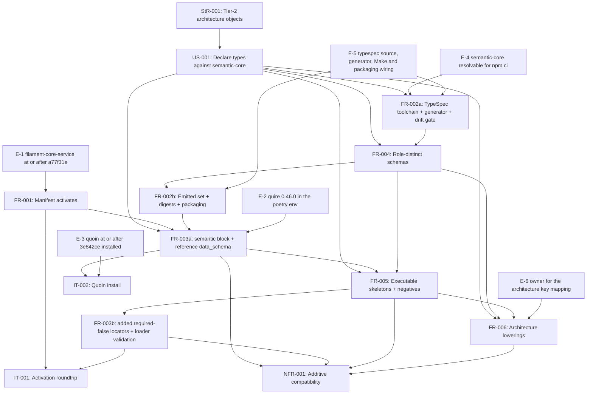

# SR-005: Dependency review of issue #8 semantic module contract

## Summary

Dependency and ordering analysis of the issue #8 spec set (StR-001, US-001,
FR-001..FR-006, NFR-001, IT-001, IT-002, TM-001) with every external
dependency the spec names verified read-only on 2026-09-04. The upstream
artifacts exist and are at the stated versions: `@agent-ix/semantic-core` 0.1.0
on npm.ix and in `node_modules`; TypeSpec compiler and emitter 1.15.0 pinned
and locked; quoin main HEAD `3e842ce` carrying FR-070..FR-075; quire-rs main
HEAD `17b80e4` carrying FR-069..FR-072 and every `semantic.*` diagnostic code
this spec relies on; filament-core-service main HEAD `a77f31e` carrying the
`semantic` block and the `data_schema` reference form; quire 0.46.0 with
`extract_semantic`, `validate_document` and `Registry.load_from` on `pypi.ix`;
`## Operations` extraction, the `sysml` Properties fence and `fields_form` all
implemented in `src/semantic/`. The named blocking issues are open and, with
one exception, accurately described.

The problems are three. First, the enablement the module rests on is
unreleased or unbuilt: the manifest schema that admits `semantic` exists on no
filament-core-service release, the Quire engine the whole test matrix rests on
is not importable from this module's Python environment, and the TypeSpec
source, generator and Make targets FR-002 and FR-005 name do not exist in the
worktree. Second, two dependency descriptions are wrong: `agent-ix/quoin#335`
does not own the architecture keys the spec assigns to it, and FR-003 states a
narrower digest-refusal blast radius than `agent-ix/quire-rs#394` measured.
Third, one NFR metric measures an empty population, because — unlike the
sibling business module — no 0.2.0 architecture skeleton carries a
`## Properties` section at all.

## Verdict

**Not ready for `spec-to-plan` as written.** Three highs (FND-160, FND-161,
FND-162) are a missing revision pin and two mis-stated dependencies; five
mediums are an empty-population metric, two verification-order inversions the
declared edges hide, an unstated repo-local input, and two enablement gaps
with no owning requirement. None is a cycle in the declared `depends_on`
edges — the FND-144/FND-145 fixes from the sibling module were carried across
— but FR-002/FR-004 and FR-003/FR-005 still invert at the verification level
and must be split before sequencing. Once FND-160..FND-166 are dispositioned,
the topological order below is the sequence to plan against.

## Findings

| ID | Severity | Summary | Refs | Escape Cause |
|----|----------|---------|------|--------------|
| FND-160 | high | FR-001 and IT-001 pin no filament-core-service revision. The module-manifest schema is top-level `additionalProperties: false`, and the `semantic` block exists only at main HEAD `a77f31e`; `git tag --contains a77f31e` is empty and the latest tag is `v0.8.34`. Every released service therefore rejects the 0.3.0 manifest, so FR-001-AC-1, FR-001-AC-2 and IT-001-SC-01/SC-02 can pass only against an unreleased main build. FR-003 Inputs does pin `a77f31e`, so the spec knows the revision matters and states it in exactly one of the three places that depend on it; FR-001 Behavior says only "`module-manifest.schema.json` v1.0.0" and IT-001 Preconditions say only "a clean cluster". | FR-001, IT-001, FR-003, spec.md | missing-requirement |
| FND-161 | high | `agent-ix/quoin#335` does not own the architecture mapping the spec assigns to it. spec.md Out of Scope, FR-004 Behavior (twice) and FR-006 Behavior/Dependencies route the Markdown mapping for `routes`, `carries`, `delivery`, `exposes`, `registration`, `stability`, `provider`, `records`, `thresholds`, `throttles`, `renders`, `requires`, `associated_types`, `versioning`, `endianness`, `serializes` and `triggers` to #335. #335 (OPEN) is scoped to the enumeration `## Values` form and the spec-objects-business keys `values`, `relations`/`members`/`owner`, `states`, `transitions`, `steps`, `emits`, `persists`, `source`, `vocabulary`; it names spec-objects-business#4 as its only downstream and no architecture key appears in it. No open ticket owns the architecture extraction path, so the "a future extractor can fill it without a schema change" promise in FR-004 has no owner. | spec.md, FR-004, FR-006 | wrong-requirement |
| FND-162 | high | FR-003 Behavior states "a refused schema drops that object type alone, while a manifest key the loader cannot parse … drops every object type of the module", and spec.md Out of Scope repeats it as "a `data_schema` digest mismatch drops the object type with no diagnostic". `agent-ix/quire-rs#394` — the issue this spec cites for that case — measured the opposite against quire 0.46.0: a wrong `data_schema.digest` makes `Registry.load_from` return an **empty** archetype list (all ten object types disappear) and `validate_document` raise `unknown archetype`. quire-rs FR-069 likewise says the loader "SHALL fail the module's object types" (plural). FR-003-AC-6 and TC-026 are written against the narrower shape, so the criterion asserts a per-type refusal the engine does not perform. | FR-003, FR-003-AC-6, spec.md, tests.md TC-026 | wrong-requirement |
| FND-163 | medium | NFR-001-AC-3 and TC-062 measure an empty population. `semantic.legacy-properties-form` is raised only from a `## Properties` section (`quire-rs/src/semantic/properties.rs`), and no checked-in 0.2.0 architecture skeleton has one: the H2 sets are `## Endpoint` + `## 2. API Contract`, `## Schema`, `## Message Format`, `## Inputs`, `## Props`, `## Contract`, `## Contract`/`## Endpoints`/`## Behavior`, `## Contract`/`## Registration`/`## Stability`, `## Layout`, `## Thresholds`. The metric row "Each legacy-form skeleton under 0.3.0: `semantic.legacy-properties-form` warnings, target 1, threshold 1" therefore has zero subjects and passes vacuously. This is where the architecture module genuinely differs from spec-objects-business, whose 0.2.0 skeletons carried bullet-list `## Properties`; the criterion was carried across without re-measuring the population. | NFR-001, NFR-001-AC-3, tests.md TC-062 | correct-requirement-no-evidence |
| FND-164 | medium | FR-003 and FR-005 invert at the verification level. FR-005 `depends_on` FR-003, and the FND-145 fix was applied (the added-locator obligation now lives in FR-005 Behavior), but FR-003-AC-3's second half ("every added locator is `required: false`") and FR-003-AC-4 (`Registry.load_from` plus `validate_document` on each skeleton) can be discharged only after FR-005 has authored the skeletons and the locators. The declared edge is a DAG; the evidence order is the reverse. Split FR-003 into FR-003a (block, `version: 0.3.0`, reference-form digests, 0.2.0 locator preservation, `lexicon` byte-identity: AC-1, AC-2, AC-3 preservation half, AC-7) before FR-005, and FR-003b (added locators, skeleton load and validation: AC-3 additions half, AC-4) after it. | FR-003, FR-005 | wrong-requirement |
| FND-165 | medium | FR-002 and FR-004 invert the same way. The FND-144 edge reversal was applied (FR-002 `depends_on` FR-004; FR-004 lists FR-002 under **Build**), but FR-004-AC-1..AC-14 all validate *emitted* `schemas/<Model>.json` files, which only FR-002's generator produces — and `typespec/` holds `tspconfig.yaml` only, with no `main.tsp`, and `scripts/generate-schemas.mjs` does not exist. Neither requirement is verifiable before the other's artifact exists. Plan as FR-002a (toolchain, generator, `$id` normalization, drift gate: AC-4, AC-5, AC-9, CON-1..CON-5) → FR-004 (models) → FR-002b (emitted set, `$ref` closure, digests, wheel and npm inclusion: AC-1..AC-3, AC-6..AC-8). | FR-002, FR-004 | wrong-requirement |
| FND-166 | medium | This repo's issue #7 is an input the ticket names and no spec artifact mentions. Issue #8 Dependencies says "Review agent-ix/filament-ide-rs#541 and this repo's #7 as dependencies/inputs", and its Deliverables say "Resolve existing malformed lexicon data as separately reviewed corpus work". #7 (OPEN) is a defect in **this repo's** `spec_objects_architecture/manifest.yaml`: eight `lexicon` definitions truncated at unquoted commas inside YAML flow mappings. spec.md Out of Scope misattributes it to "the malformed `lexicon` entries **the corpus** carries" and routes it to `agent-ix/quoin#291`, a corpus sweep gate that does not cover this repository's own manifest. FR-003 Behavior and FR-003-AC-7 then require the 0.2.0 `lexicon` block byte-identical at 0.3.0, which freezes the defect and leaves a later #7 fix as a manifest change no requirement covers. | spec.md, FR-003, FR-003-AC-7 | missing-requirement |
| FND-167 | medium | The build and provisioning enablement FR-002 and FR-005 assume is absent from the worktree and belongs to no requirement as a task. Missing: `typespec/main.tsp`; `scripts/generate-schemas.mjs`; Makefile targets `schemas`, `schemas-check` and `dev-quire`; `make lint` running `make schemas-check`; and `pyproject.toml` `include`, which lists only `manifest.yaml` and `skeletons/*.md`, so FR-002-AC-6 (wheel carries `schemas/*.json`) fails as configured. Already met, and worth not re-doing: `package.json` `files` lists `schemas/`, `scripts/stage-npm.mjs` already stages `manifest.yaml` + `schemas/` + `skeletons/` with Node built-ins only, and `.gitattributes` already marks `*.json` and `*.tsp` `eol=lf`. | FR-002 Behavior, FR-002-AC-6, FR-005 Behavior | missing-requirement |
| FND-168 | medium | Quire 0.46.0 is not reachable from the environment the matrix runs in. `poetry run python -c "import quire"` in this worktree fails with `ModuleNotFoundError` (env is Python 3.13); the 0.46.0 wheel exists only on `pypi.ix` (`pip index versions quire --index-url http://pypi.ix/root/dev/+simple/` → 0.46.0, 0.33.0, …), which `pyproject.toml` declares as an `explicit` source no committed dependency may reference; no `quire-rs` tag contains `17b80e4` (latest `v0.45.0`). The spec states all of this correctly and `agent-ix/quire-rs#392` is OPEN and accurately described, but `make dev-quire` — the step every Quire-bearing row depends on — exists in no Makefile and in no plan. Around 45 `Integration` rows (TC-013..TC-016, TC-024..TC-026, TC-031..TC-043, TC-050..TC-057, TC-061..TC-063, TC-065, TC-071..TC-073, TC-080..TC-085) are gated on it. | FR-005, tests.md Test Environment | missing-requirement |
| FND-169 | low | FR-003 calls its key list "the nine admitted keys" (FR-003-AC-1) and FR-003-CON-1 forbids "a key outside the admitted list". quoin FR-070 admits **ten**: the nine this module sets plus `sweep_report` (FR-074), and the vendored schema carries all ten with `additionalProperties: false`. The set is right; the label is not — it is the nine keys this module *declares*, not the admitted set. | FR-003-AC-1, FR-003-CON-1 | wrong-requirement |
| FND-170 | low | `targets: [json-schema, markdown]` is admissible but draws from two enums. In filament-core-data `schema/semantic/v1/common.schema.json`, `json-schema` is a `target` value and `markdown` a `representationFormat` value; quoin FR-070 admits the union of the two, so the manifest passes. The spec does not say which registry each token comes from, so a later split of the two enums would break the manifest with no requirement pointing at the cause. | FR-003 Behavior | correct-requirement-no-evidence |
| FND-171 | low | `mappings: [typed-table, sysml-fence, ocl-clause]` are free strings. The vendored manifest schema types `mappings` as `items: string`, and neither Quoin nor Quire validates mapping names against a registry, so FR-003-AC-1 checks the manifest against this specification rather than against a consumer. Unchanged from the sibling module's FND-147; recorded so the plan does not claim enforcement evidence for this key. | FR-003-AC-1 | correct-requirement-no-evidence |
| FND-172 | low | FR-003-AC-6's naming half depends on defect reports, not on a stated upstream obligation. quire-rs FR-069 requires only that the loader "fail the module's object types with a `semantic.*` reason"; no quire-rs acceptance criterion obliges naming the key, the path, or the expected/actual digest. `agent-ix/quire-rs#221` (OPEN) additionally asks whether current main still has the shape it describes — it was observed against a v0.40-era engine and an unknown *top-level* key, not a key inside `semantic` — so the expected-failure row can stay red through an upstream change that fully satisfies FR-069. The naming obligation needs to be added upstream or the criterion rewritten to what FR-069 promises. | FR-003-AC-6, tests.md TC-026 | correct-requirement-no-evidence |
| FND-173 | low | spec.md References cite filament-core-data "ADR-0005 (TypeSpec source)". No `ADR-0005*` file exists in filament-core-data and its `spec/` has no `adr/` directory; the decision is recorded only in `spec.md`, `log.md` and `index.md`. The reference resolves to a decision record that was never written. Unchanged from the sibling module's FND-148. | spec.md | wrong-requirement |
| FND-174 | low | Two inputs the ticket names are traceable from no spec artifact. `agent-ix/filament-core-data#34` (CLOSED — the closed IR v1.1 constraint keyword vocabulary) is named by the ticket's authoring contract, but FR-004 uses `ConstraintDecl` without naming the closed vocabulary, and the engine's `semantic.unknown-constraint-keyword` refusal is not covered by any criterion. `agent-ix/filament-ide-rs#541` (OPEN, the Project 17 cross-language resource graph) is named by the ticket's Dependencies, while spec.md refers to "Project 17" in prose only. Both are traceability gaps, not behavioural ones. | spec.md, FR-004 | missing-requirement |

## External Dependency Verification

Read-only checks performed on 2026-09-04. "Stated" is what the spec or the
ticket names; "Found" is what exists.

| Dependency | Stated | Found | Status |
|---|---|---|---|
| `@agent-ix/semantic-core` | 0.1.0 from npm.ix, models `FieldDecl`, `TypeRef`, `Multiplicity`, `ConstraintDecl`, `RelationDecl`, `OperationDecl`, `ClauseRef`, `EnumValue`, `KernelScalar`, `Identifier`, `SemanticId` | `npm view --registry=http://npm.ix/` → 0.1.0 (only version); present in `node_modules` at 0.1.0; `package-lock.json` resolves to `http://npm.ix/@agent-ix/semantic-core/-/semantic-core-0.1.0.tgz` | exists, correct version; local-registry only (`filament-core-data#11` OPEN) |
| TypeSpec toolchain | `@typespec/compiler` 1.15.0, `@typespec/json-schema` 1.15.0, exact devDependencies | both exact in `package.json`, locked; no `.npmrc`, no `file:`/`link:` dependency | exists, correct version |
| quoin | main at/after `3e842ce`, FR-070..FR-075 | main HEAD is `3e842ce`; FR-070..FR-075 all present; the installed CLI reports `0.23.1-2-g3e842ce` and its `dist/semantic/` carries `package-manifest`, `data-schema`, `contract`, `manifest` | exists on main **and installed here**; no tag contains it (latest `v0.23.1`), so IT-002 stays a dev-machine demonstration |
| quire-rs source | main, FR-069..FR-072; `semantic.record-invalid`, `semantic.unresolved-type`, `semantic.legacy-properties-form`, `semantic.properties-both-forms`, `semantic.dangling-clause-ref`, `semantic.invalid-type-token` | main HEAD `17b80e4`; FR-069..FR-072 present; all six codes present, plus `semantic.data-schema-digest-mismatch`, `semantic.unknown-key`, `semantic.sysml-outside-subset`, `semantic.invalid-operation-table`; `## Operations` with `Returns:`/`Pre:`/`Post:` and the `Param \| Type \| Multiplicity \| Constraints` header implemented in `src/semantic/clauses.rs`; the `sysml` Properties fence and `fields_form` in `src/semantic/properties.rs`/`surface.rs` | exists on main; `declaration_record()` emits `fields`, `clauses`, `operations` only — no `relations` and no architecture key, which is what FR-004 assumes |
| quire wheel | 0.46.0 with `extract_semantic`, provisioned by `make dev-quire` | `pypi.ix` serves 0.46.0; `quire --version` → `quire 0.31.0 (cli 4f6ed024, engine 0.46.0@ca7362d4)`; system Python imports `quire` with `extract_semantic`; the module's poetry env (3.13) does **not** (`ModuleNotFoundError`); `make dev-quire` does not exist | untagged, uncommittable, unprovisioned (FND-168) |
| module-manifest schema (FR-035) | `filament-core-service` revision `a77f31e` (CR-003), vendored byte-identically by Quoin and Quire | main HEAD is `a77f31e`; the schema carries the `semantic` block and top-level `additionalProperties: false`; quire-rs FR-069 Inputs records the same revision and path in its vendored provenance | exists on main; no release contains it (`git tag --contains a77f31e` empty, latest `v0.8.34`) — FND-160 |
| filament-core-service FR-026, FR-034, FR-035 | referenced by FR-001 | all three present in `spec/functional/` | exists |
| filament-core-data FR-031..FR-034, NFR-014, ADR-0005 | referenced by spec.md, FR-002, FR-004 | FR-031..FR-034 present; ADR-0005 has no file (FND-173) | partially missing |
| target registry | `targets: [json-schema, markdown]` | `schema/semantic/v1/common.schema.json`: `target` enum holds `json-schema`; `representationFormat` enum holds `markdown` | admissible; drawn from two enums (FND-170) |
| `agent-ix/quire-rs#392` | 0.46.0 wheel on no committable index; `internal-pypi` serves 0.33.0 at most | OPEN; body states exactly that, plus "latest tag `v0.45.0`, `git tag --contains 17b80e4` empty" | described correctly |
| `agent-ix/quire-rs#221` | unknown manifest key empties the model silently | OPEN; matches, with the caveat that it was observed against a v0.40-era engine and a top-level key and asks for re-verification on main | described correctly; scope caveat (FND-172) |
| `agent-ix/quire-rs#394` | a `data_schema` digest mismatch drops the object type with no diagnostic | OPEN; measured blast radius is **module-wide** — an empty archetype list and `unknown archetype` | described **incorrectly** (FND-162) |
| `agent-ix/quire-rs#391` | legacy-form artifact declaring `object:` validates its record as `{}`, so it errors under `legacy_forms: warning` | OPEN; matches, scoped to a `fields`-required schema | described correctly |
| `agent-ix/quire-rs#388` | merged, the semantic extraction boundary | CLOSED 2026-09-04, merged as `17b80e4` | described correctly |
| `agent-ix/filament-core-service#23` | reference-form `data_schema` not resolved into a stored snapshot at activation | OPEN; "Produce the semantic context and resolved `data_schema` in ObjectType registry snapshots" | described correctly |
| `agent-ix/filament-core-data#21`, `#22`, `#23` | Rust / TypeScript / Python codegen backends producing generated-language fixtures | all OPEN with those titles | described correctly |
| `agent-ix/filament-core-data#11` | semantic-core language packages, unpublished | OPEN | described correctly |
| `agent-ix/filament-core-data#34`, `#35` | semantic IR v1.1, semantic-core L3 grammar — "now exist and are merged" | both CLOSED (2026-09-04) | described correctly; #34 not traced (FND-174) |
| `agent-ix/quoin#290`, `#291` | promotion gate, corpus sweep gate | both OPEN with those roles | described correctly |
| `agent-ix/quoin#293` | semantic module packages contract, merged | CLOSED 2026-09-04, merged as `3e842ce` | described correctly |
| `agent-ix/quoin#335` | owner of the Markdown mapping for the architecture keys | OPEN, but scoped to enumeration `## Values` and the spec-objects-business keys only | described **incorrectly** (FND-161) |
| `agent-ix/quire-contract-ir#52`, `filament-core-data#36` | downstream fixture readers | both OPEN | described correctly |
| `agent-ix/spec-objects-architecture#7` | not referenced | OPEN — eight truncated `lexicon` definitions in this repo's manifest | named by the ticket, absent from the spec (FND-166) |
| `agent-ix/filament-ide-rs#541` | "Project 17" in prose | OPEN — "Epic: add a cross-language resource graph" | named by the ticket, not traced (FND-174) |
| Repository build assets | `typespec/main.tsp`, `scripts/generate-schemas.mjs`, `make schemas`, `make schemas-check`, `make dev-quire`, `pyproject.toml` include of `schemas/*.json` | none present; `typespec/` holds `tspconfig.yaml` only | absent (FND-167) |
| Repository build assets already correct | `.gitattributes` `eol=lf`, `package.json` `files` with `schemas/`, `scripts/stage-npm.mjs` | all present and Node-built-ins only | exists |

## Classification

| Requirement | Class | Rationale |
|-------------|-------|-----------|
| StR-001 | Feature (root need) | Stakeholder need for extractable architecture graph entities; no implementation of its own |
| US-001 | Feature (root story) | Maintainer story realised by FR-002..FR-006 |
| FR-001 | Enablement | Manifest activation against filament-core; already satisfied at 0.2.0 and the prerequisite for every manifest change |
| FR-002 | Enablement | TypeSpec toolchain, generator, `$id` normalization, drift gate, packaging of `schemas/`; no business-visible behaviour of its own |
| FR-003 | Enablement | Manifest `semantic` block, reference-form `data_schema`, locator preservation; a contract, not a behaviour authors see |
| FR-004 | Feature | The role-distinct schemas are what authors, reviewers and the downstream frontends consume |
| FR-005 | Feature | Executable skeletons and negative fixtures are the module's user-visible authoring contract |
| FR-006 | Feature | The three lowerings are the architecture-specific reference `quire-contract-ir#52` reads; the operation-shaped one exists nowhere else |
| NFR-001 | Constraint | Additive-compatibility bound on FR-003, FR-005 and FR-006; verified by its own tests, implements nothing |
| IT-001 | Verification | Verifies FR-001 against a running filament-core-service |
| IT-002 | Verification | Verifies FR-003 against a Quoin built from main |

Enablement outside the FR set that the plan must carry as explicit tasks
(none has a requirement of its own today):

1. E-1 filament-core-service released or deployed at/after `a77f31e` (FND-160).
2. E-2 quire 0.46.0 reachable from the module's Python 3.13 poetry environment via a `make dev-quire` target (FND-168).
3. E-3 quoin built and installed from main at/after `3e842ce` — satisfied on this machine today (`0.23.1-2-g3e842ce`), unsatisfiable from any release.
4. E-4 `@agent-ix/semantic-core` resolvable where `npm ci` runs; FR-002-CON-4 already states the local-only scope of the drift gate, and `filament-core-data#11` is the unblock.
5. E-5 build and packaging scaffolding: `typespec/main.tsp`, `scripts/generate-schemas.mjs`, `make schemas` / `make schemas-check` / `make lint` wiring, `pyproject.toml` include for `schemas/*.json` (FND-167).
6. E-6 an owning ticket for the architecture-key Markdown mapping, since `quoin#335` does not cover it (FND-161).

## Dependency Graph

Edges are the explicit prerequisites the spec states, after the two splits
proposed in FND-164 and FND-165 (FR-002a toolchain, FR-002b emitted set;
FR-003a contract block and digests, FR-003b added locators and skeleton load).
External prerequisites appear as the enablement items E-1..E-6.

External prerequisites by requirement. Each is a hard edge; the artifact is
listed under FND-160..FND-168 where it is not yet released, owned or
provisioned.

| Requirement | External prerequisite |
|---|---|
| FR-001 | filament-core-service FR-026, FR-034, FR-035 at `a77f31e` (FND-160) |
| FR-002 | semantic-core 0.1.0 (filament-core-data FR-031, FR-033); TypeSpec 1.15.0; `filament-core-data#11` for CI reach |
| FR-003 | quoin FR-070, FR-073; quire-rs FR-069; the module-manifest schema at `a77f31e`; quire 0.46.0 for AC-4 and AC-6 |
| FR-004 | semantic-core 0.1.0 grammar (filament-core-data FR-031, NFR-014, and the closed constraint vocabulary of `filament-core-data#34`); quire-rs FR-070/FR-071 record shape |
| FR-005 | quoin FR-071, FR-072; quire-rs FR-070, FR-071, FR-072; quire wheel 0.46.0 (`quire-rs#392`); the `quire-rs#391` expected failure |
| FR-006 | quoin FR-072; an owner for the architecture-key mapping (`quoin#335` is not it — FND-161) |
| NFR-001 | quoin FR-074; a legacy-Properties population that does not exist (FND-163) |
| IT-001 | a running filament-core-service at/after `a77f31e` |
| IT-002 | quoin FR-070, FR-073, FR-075 built from main at/after `3e842ce` |

## Topological Order (suggested implementation sequence)

1. Enablement, parallelizable: E-5 (typespec source skeleton, generator script, Make and packaging wiring), E-2 (`make dev-quire` and the wheel in the poetry env), E-4 (semantic-core reach for `npm ci`, or FR-002-CON-4's local-only scope confirmed), E-6 (file or extend the architecture-key mapping ticket), E-3 (quoin from main — already installed), E-1 (filament-core-service at/after `a77f31e`).
2. FR-002a: toolchain pins, `scripts/generate-schemas.mjs`, `$id`/`$ref` normalization, `make schemas` and `make schemas-check`, determinism and stale-file gates (TC-013, TC-014, TC-016..TC-019, TC-073, TC-074).
3. FR-004: the ten object-type models plus the marker, value and enum support models in `typespec/main.tsp`; schema-level positive and negative record tests (TC-030..TC-044).
4. FR-002b: emitted set, `toolchain.json`, digests, wheel and npm tarball inclusion (TC-010..TC-012, TC-015, TC-071, TC-072).
5. FR-003a: manifest `version: 0.3.0`, the `semantic` block, reference-form `data_schema`, 0.2.0 locator preservation, `lexicon` byte-identity (TC-020..TC-022, TC-028).
6. FR-005: skeleton rewrite to typed forms, the three `sysml` alternates, `object:` frontmatter, `Identifier` titles, the ten negative fixtures, and the `required: false` locators the new sections need (TC-050..TC-059, TC-065).
7. FR-003b: the added-locator and loader-validation criteria that need the FR-005 skeletons (TC-023..TC-026).
8. FR-006: the three lowerings and their agreement assertions (TC-080..TC-086).
9. NFR-001 verification (TC-060..TC-064, with TC-062's population resolved per FND-163); IT-002 demonstration (TC-027, TC-070); IT-001 re-run against E-1 (TC-001..TC-004).

FR-002a and the E-items are parallel. Nothing in the feature layer is
parallel after step 3: every later step consumes the previous step's bytes
(models, digests, locators, skeletons), and FR-006 consumes both FR-004's
models and FR-005's authored artifacts.

## Cycles

None in the declared `depends_on` edges. The two cycles the sibling module
carried (FR-002 ⇄ FR-004, FR-003 ⇄ FR-005) were broken before this spec set
was written — FR-002 `depends_on` FR-004 with FR-004 naming FR-002 only as its
**Build**, and the added-locator obligation moved into FR-005 Behavior.

Two verification-order inversions remain, and they are not visible in the
edges: FR-004's criteria need FR-002's generator (FND-165), and FR-003-AC-3's
additions half and FR-003-AC-4 need FR-005's skeletons (FND-164). Both are
removed by the FR-002a/FR-002b and FR-003a/FR-003b splits used in the graph
and the topological order above.
