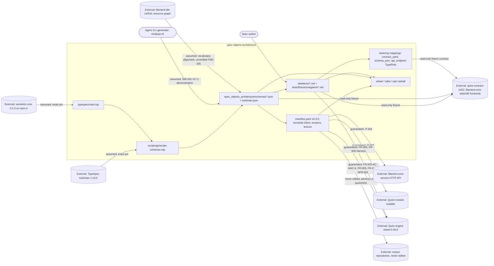

# SR-004: Scope and boundary review of the #8 semantic module contract spec

## Summary

This analysis drew the boundary of `spec-objects-architecture` as specified on
`spec/8-semantic-module-contract`, allocated every StR/US/FR/NFR/IT to an
owning component and responsibility class, and checked each responsibility the
spec claims, disclaims, or leans on against the neighbouring owners:
`filament-core-service` FR-035 and issue #23 (activation, resolved
`data_schema`), `quoin` FR-070..FR-075 and issues #290/#291/#335 (install,
mappings, digests, legacy forms, gates), `quire-rs` FR-069..FR-072 and issues
#221/#391/#392/#394 (loader, extraction, record surface, wheel),
`filament-core-data` FR-031..FR-034 and issues #11/#19/#21/#22/#23/#36
(semantic-core grammar and compiler backends), the corpus repositories this
ticket must not edit, and the sibling module `spec-objects-business` (issue #4,
review SR-007).

The boundary is drawn correctly in the large. The module owns its TypeSpec
source, the ten emitted schemas, the manifest `semantic` block, the skeleton
and negative fixture set, and the three architecture-specific lowerings; it
re-specifies neither extraction, nor install-time rejection, nor IR lowering.
Every upstream blocker the task named is present in `spec.md` Out of Scope
except one, and each named issue resolves to a real, open ticket with the
title the spec implies — a materially better starting point than the sibling
module had.

Twelve findings: three high, four medium, five low. The highs are the three
places where an out-of-scope allocation names an owner that does not own the
work (`quoin#335` for the architecture record keys), a pin that does not exist
(FR-035 revision `a77f31e` attributed to FR-001), or a defect placed outside
the boundary that lives inside it (the malformed `lexicon`, which is this
repo's own `manifest.yaml` and this repo's own issue #7).

## Verdict

**Conditional pass.** The In Scope / Out of Scope split in `spec/spec.md` is
sound and no requirement in FR-001..FR-006 duplicates a quoin, quire-rs,
filament-core-data or filament-core-service responsibility outright. Before
tasking, the three highs need disposition: FND-300 needs a ticket that
actually covers the architecture keys (file one on quoin, or extend #335 and
say so), FND-301 needs `a77f31e` written into FR-001 and IT-001 or the
cross-reference in FR-003 Inputs corrected, and FND-302 needs the `lexicon`
defect re-allocated from "the corpus" to `agent-ix/spec-objects-architecture#7`
with FR-003-AC-7 stated as a deliberate freeze over known-malformed data. The
four mediums close evidence gaps at the edges; none of them moves the boundary.

## System Context

## In-Scope Responsibilities

What the module guarantees (`spec.md` In Scope, FR-001..FR-006, NFR-001):

- Publish `spec_objects_architecture/manifest.yaml` conforming to
  filament-core-service FR-035 and activating idempotently against
  `POST /api/v1/modules/activate` (FR-001).
- Author one TypeSpec model per architecture object type importing
  `@agent-ix/semantic-core` 0.1.0 and emit one JSON Schema 2020-12 document per
  model with the official emitter at a pinned toolchain, with `$id`/`$ref`
  rules, determinism, a version-bump procedure and a drift check wired into
  `make lint` (FR-002).
- Carry the quoin FR-070 `semantic` block and reference-form `data_schema`
  (path + SHA-256) for all ten exported object types at manifest version
  0.3.0, keeping every 0.2.0 locator unchanged and every added locator
  optional (FR-003).
- Define the role-distinct declaration-record shape per object type — required,
  optional and forbidden keys, item rules, and the architecture support models
  (`RouteDecl`, `DeliveryPolicy`, `VersioningPolicy`, `RegistrationPolicy`,
  `StabilityPolicy`, `RecordLayout`, `LayoutField`, `Threshold`,
  `ExceedResponse` and their closed enums) — with every grammar item by `$ref`
  to semantic-core, never redeclared (FR-004).
- Ship every skeleton as an executable positive fixture in the quoin
  FR-071/FR-072 Markdown forms, with three `sysml` alternates and a negative
  fixture set pinning what the schemas refuse; provision the engine by
  `make dev-quire` and fail rather than skip when it is absent (FR-005).
- Own the three architecture-specific lowerings — `interface` `contract_yaml`
  to `OperationDecl[]`, `data_schema` `schema_json` registered as a `TypeRef`
  target, `api_endpoint` params and returns as `TypeRef`s — as mappings proven
  by agreement tests between two sections of one authored artifact (FR-006).
- Keep the change additive: no 0.2.0 locator changed, no 0.2.0 skeleton turned
  into an error, every 0.2.0 locator yield byte-identical, `allowed_links` and
  `roles` unchanged (NFR-001).
- Package the schemas beside the manifest in the wheel, sdist and npm tarball
  (FR-002).

What the module explicitly disclaims (`spec.md` Out of Scope), with the owner
it names:

| Disclaimed responsibility | Named owner | Owner verified |
|---|---|---|
| `filament-core-service` behaviour; deployment topology | filament-core-service (FR-035) | Yes |
| Generated-language fixtures for the architecture types | filament-core-data #21 (Rust), #22 (TS), #23 (Python); gate quoin#290; semantic-core packages #11 | Tickets real; allocation incomplete (FND-304) |
| Extraction of 13 declared-but-unextracted keys from Markdown | quoin#335 (mapping) then quire-rs | Ticket real; **does not cover these keys** (FND-300) |
| Enabling impact propagation / extraction behaviour for the resource graph | the ticket's own safety gate | Yes |
| Naming what a module load refused | quire-rs#221, quire-rs#394 | Yes — both open, both match |
| Record validation of a legacy-form artifact declaring `object:` | quire-rs#391 | Yes — open, matches |
| Publishing the Quire 0.46.0 wheel to a committable index | quire-rs#392 | Yes — open, matches |
| Resolving reference-form `data_schema` into a stored snapshot at activation | filament-core-service#23 | Owner correct; cited evidence wrong (FND-303) |
| Editing any corpus repository; malformed `lexicon`; legacy sweep and promotion | quoin#291 | Sweep yes; **`lexicon` is in-boundary** (FND-302) |
| Replacing the measured cross-language resource-extraction contracts | "Project 17" | Board, not ticket; alignment unowned (FND-305) |

## External Dependencies

| Dependency | Type | Assumed or Guaranteed | Contract |
|------------|------|------------------------|----------|
| filament-core-service activation API and registry endpoints | HTTP | Guaranteed | IT-001 roundtrip; FR-001-AC-2..AC-4 |
| filament-core-service module-manifest schema (FR-035 with the `semantic` block) | JSON Schema, vendored byte-identically by Quoin and Quire | Assumed | FR-003 Inputs pins `a77f31e`; FR-001 and IT-001 do not (FND-301) |
| filament-core-service#23 (resolved `data_schema` in registry snapshots) | Future service behaviour | Assumed absent | Spec claims FR-001-AC-4 / IT-001-SC-03 assert verbatim storage; they do not (FND-303) |
| Quoin module installer (FR-070, FR-073, FR-075) | Local CLI over the filesystem | Guaranteed | IT-002 SC-01..SC-06; FR-003-AC-5 (Demonstration) |
| Quoin mapping publication (FR-071, FR-072) | Published Markdown-to-grammar mapping | Assumed | FR-005 authors to the published forms; the architecture-specific keys are unmapped (FND-300) |
| Quire engine: loader FR-069, extraction FR-070/FR-071, record surface FR-072 | Python wheel 0.46.0 (`Registry`, `validate_document`, `extract_semantic`) | Guaranteed, no IT of its own | FR-003-AC-4/AC-6, FR-004-AC-13, FR-005-AC-1..AC-9, FR-006-AC-1..AC-6, NFR-001 metrics; `spec.md` Requirements Architecture states the FR harness is the contract test |
| Quire wheel availability | pypi.ix dev-only; `internal-pypi` serves 0.33.0 | Assumed unavailable | `make dev-quire` + fail-not-skip rule; quire-rs#392 |
| `semantic.record-invalid` diagnostic | Engine behaviour named in no quire-rs AC | Assumed | FR-005 Dependencies name quire-rs#391 as where the contract is settled |
| `@agent-ix/semantic-core` 0.1.0 (filament-core-data FR-031..FR-033) | npm package on npm.ix; schema bundle at `https://schemas.agent-ix.org/semantic-core/0.1.0/` | Assumed | Exact pin in `package.json`; `$ref` host/version check FR-002-AC-3; FR-004-CON-1 |
| `@typespec/compiler` / `@typespec/json-schema` 1.15.0 | npm devDependencies | Assumed | Exact pin, `package-lock.json`, versions recorded in `toolchain.json` (FR-002-AC-1) |
| npm.ix routing for `@agent-ix` | Developer-machine npm config | Assumed | FR-002-CON-4; the drift gate is unrunnable without it (FND-311) |
| Agent CLI generators (`minijinja-cli`) | Consumer | Assumed | StR-001-VC-2 demonstration; templates promised but not shipped (FND-308) |
| quire-contract-ir#52 and filament-core-data#36 frontends | Downstream read-only consumers of schemas, skeletons and lowerings | Assumed | No contract; consumers pin their own fixtures |
| Corpus repositories | Downstream, never edited | Assumed | FR-005-CON-1, TC-058 diff; NFR-001 operational context; quoin#291 |
| filament-ide-rs#541 cross-language resource graph | Vocabulary neighbour | Assumed | No requirement, no criterion (FND-305) |

## Responsibility Allocation

Components: **Module build** (`typespec/`, `scripts/generate-schemas.mjs`,
`make schemas` / `schemas-check`), **Module manifest**
(`spec_objects_architecture/manifest.yaml`), **Fixture set** (`skeletons/`,
`tests/fixtures/negative/`), **Lowering contract** (the three mappings and
their agreement assertions), **Packaging** (wheel, sdist, npm staging),
**Integration harness** (the IT tests and the neighbour CLIs they drive).

| Requirement | Owning Component | Class |
|-------------|------------------|-------|
| StR-001 (extractable tier-2 architecture objects) | Module manifest | core |
| US-001 (declare architecture objects against semantic-core) | Module build | core |
| FR-001 (manifest activates against filament-core) | Module manifest | infrastructure |
| FR-002 (emit JSON Schemas from TypeSpec at a pinned toolchain) | Module build | core |
| FR-002-CON-2, FR-002-AC-6/AC-7 (packaging, no `.npmrc`, exact pins, tarball layout) | Packaging | infrastructure |
| FR-002-CON-5, FR-002-AC-8 (version-bump atomicity) | Module build | cross-cutting |
| FR-003 (semantic block, reference-form `data_schema`, locator stability) | Module manifest | core |
| FR-003-AC-5, FR-003 install/list behaviours | Integration harness | cross-cutting |
| FR-004 (role-distinct declaration schemas and support models) | Module build | core |
| FR-004-CON-1 (no semantic-core redeclaration) | Module build | cross-cutting |
| FR-005 (executable skeletons and negative fixtures) | Fixture set | core |
| FR-005 `make dev-quire` and the fail-not-skip rule | Fixture set | cross-cutting |
| FR-006 (the three architecture lowerings and their agreement tests) | Lowering contract | core |
| NFR-001 (additive compatibility: locators, yields, edge vocabulary) | Module manifest | cross-cutting |
| IT-001 (activation roundtrip) | Integration harness | infrastructure |
| IT-002 (Quoin install with the semantic contract) | Integration harness | infrastructure |

Every StR/US/FR/NFR/IT above carries exactly one owning component and one
class, with no TBD entry.

Responsibilities the spec names that belong to a neighbour (allocated there,
not here):

| Responsibility | Owner | Where the neighbour claims it |
|----------------|-------|-------------------------------|
| Reject unknown `semantic` key, bad export, digest mismatch, unshipped `$ref`, path escape at install | Quoin | quoin FR-070, FR-073 |
| Derive `semantic/package-manifest.json` and per-export digests | Quoin | quoin FR-075 (IT-002-SC-04 is a contract check on it) |
| Legacy-form detection and `semantic.legacy-properties-form` | Quoin (policy) / Quire (detection) | quoin FR-074 |
| Fail an object type with a `semantic.*` reason at load; record the digest | Quire | quire-rs FR-069 |
| `## Properties` table/fence to `FieldDecl[]`; type-token resolution; `semantic.unresolved-type`; both-forms refusal | Quire, mapping published by Quoin | quoin FR-071; quire-rs FR-070 |
| `## Invariants` / `## Operations` to `ClauseRef[]` / `OperationDecl[]`; dangling `Pre:`/`Post:` refusal | Quire, mapping published by Quoin | quoin FR-072; quire-rs FR-071 |
| `availability` states and the `semantic` record surface | Quire | quire-rs FR-072 |
| Naming the key, path or digest a refused load rejected | Quire | quire-rs#221, quire-rs#394 (open; FR-003-AC-6 naming half is an expected failure) |
| Record validation of a legacy-form artifact declaring `object:` | Quire | quire-rs#391 (open; expected failure beside NFR-001-AC-2) |
| Publishing the Quire wheel to a committable index | quire-rs | quire-rs#392 |
| semantic-core grammar, scalars, JSON Schema projection, IR lowering | filament-core-data | FR-031..FR-034 |
| Resolving a reference-form `data_schema` at activation | filament-core-service | issue #23 |
| Executing the `contract_yaml` lowering inside the engine | Quoin mapping, then quire-rs | FR-006 Behavior defers it explicitly |
| Mapping the 13 architecture record keys from Markdown | Claimed for quoin#335; **#335 covers the business module's keys only** | FND-300 |
| Generated-language fixtures for the architecture types | Claimed for filament-core-data #21/#22/#23; **no frontend named to feed them** | FND-304 |
| Alignment with the cross-language resource graph | Claimed for "Project 17"; **no ticket, no requirement** | FND-305 |
| Fixing the truncated `lexicon` definitions | Claimed for the corpus / quoin#291; **is this repo's own issue #7** | FND-302 |
| Templates for `minijinja-cli` generators | **Unowned** — StR-001-VC-2 promises them; no FR, none shipped | FND-308 |

## Findings

| ID | Severity | Summary | Refs | Escape Cause |
|----|----------|---------|------|--------------|
| FND-300 | high | `spec.md` Out of Scope places extraction of the thirteen architecture keys (`routes`, `carries`, `delivery`, `exposes`, `registration`, `stability`, `provider`, `records`, `thresholds`, `throttles`, `renders`, `requires`, `associated_types`) with `agent-ix/quoin#335`, and FR-004 Behavior and FR-006 Behavior repeat that owner. Issue #335 is titled for the enumeration `## Values` form and its "Also unmapped" table enumerates the *business* module's keys (`values`, `members`, `owner`, `states`, `transitions`, `steps`, `emits`, `persists`, `source`, `vocabulary`); not one architecture key appears in it, and its Ask is scoped to `spec-objects-business#4`. The responsibility is disclaimed here and claimed nowhere. FR-004's optional-key rule and the hand-built-record rule in FR-004 Behavior make the gap survivable but do not own it. Extend #335 to the architecture key set (and say so in the ticket), or file the architecture mapping ticket and cite that id in `spec.md`, FR-004 and FR-006. | `spec.md` Out of Scope; FR-004 Behavior (optional keys, hand-built records); FR-006 Behavior (engine-side mapping); US-001 Notes; quoin#335 | missing-requirement |
| FND-301 | high | FR-003 Inputs pins the module-manifest schema to "`agent-ix/filament-core-service` revision `a77f31e` (CR-003) — the same revision FR-001 names". FR-001 names no revision: its Description says "FR-035 v1.0.0", its Behavior says "`module-manifest.schema.json` v1.0.0", and IT-001 Preconditions name none either. `spec.md`'s relationship block also carries the bare `ix://agent-ix/filament-core-service/FR-035`. So the sentence that makes all three consumers judge one schema asserts a cross-reference that does not exist, and FR-001-AC-1 (schema test) and FR-003 can be verified against different revisions — a v1.0.0 schema with root `additionalProperties: false` would refuse the FR-003 manifest outright. Write `a77f31e` into FR-001 Behavior and IT-001 Preconditions, or correct FR-003 Inputs. This is the sibling's FND-210 disposition applied to one requirement and asserted of another. | FR-003 Inputs; FR-001 Description, Behavior, FR-001-AC-1; IT-001 Preconditions; `spec.md` relationships; spec-objects-business SR-007 FND-210 | wrong-requirement |
| FND-302 | high | `spec.md` Out of Scope reads "Editing any corpus repository or vendored fixture, and the malformed `lexicon` entries the corpus carries; the legacy-form sweep and corpus promotion are `agent-ix/quoin#291`". The malformed `lexicon` is not in the corpus: it is in this module's own `spec_objects_architecture/manifest.yaml` (line 260), and it is this repository's issue #7, "8 lexicon definitions are silently truncated by unquoted commas in YAML flow mappings" — which the #8 ticket names as a dependency/input and which the spec cites nowhere. FR-003 Behavior and FR-003-AC-7 then require that block byte-identical at 0.3.0, freezing known-malformed in-boundary data under an out-of-boundary justification. Re-allocate to `agent-ix/spec-objects-architecture#7`, state FR-003-AC-7 as a deliberate freeze pending that ticket, and drop the corpus framing. | `spec.md` Out of Scope; FR-003 Behavior (`lexicon` carried forward), FR-003-AC-7; `spec_objects_architecture/manifest.yaml:257-260`; issue #8 "Dependencies and sequencing"; issue #7 | wrong-requirement |
| FND-303 | medium | `spec.md` Out of Scope says of `agent-ix/filament-core-service#23`: "Until it lands the service stores the reference verbatim, which is what FR-001-AC-4 and IT-001-SC-03 assert." Neither criterion asserts it. FR-001-AC-4 asserts that each declared archetype/object_type/artifact_type *appears* in the corresponding table; IT-001-SC-03 is the idempotent re-activation criterion (same `modules.id`, same content hash). The verbatim-reference behaviour is asserted by no criterion in this spec, so nothing goes red the day fcs#23 changes what the service stores. Either add the assertion to IT-001-SC-02 (the registry-contents step) or drop the claim that it is already asserted. | `spec.md` Out of Scope (fcs#23 paragraph); FR-001-AC-4; IT-001 SC-02, SC-03; filament-core-service#23 | correct-requirement-no-evidence |
| FND-304 | medium | Generated-language fixtures are allocated to the compiler backends `filament-core-data#21` (Rust), `#22` (TypeScript), `#23` (Python) behind the `quoin#290` gate, with `#11` for the semantic-core language packages. Those backends consume the versioned semantic IR; nothing lifts *this module's* TypeSpec into that IR unless the TypeSpec frontend `filament-core-data#19` runs first, and #19 is named nowhere in this spec. The sibling module allocates the identical deliverable to `#19` + `quoin#290` (spec-objects-business SR-007 FND-201 disposition), so the two modules of one campaign name different owners for one deliverable. Name the frontend (#19) as the producer and the backends as its emitters, and align the two modules' wording. | `spec.md` Out of Scope (generated-language fixtures); filament-core-data #19, #21, #22, #23, #11; quoin#290; spec-objects-business `spec.md` | wrong-requirement |
| FND-305 | medium | Issue #8 Deliverables require aligning resource semantics with the Project 17 cross-language resource-graph work, and `spec.md` Out of Scope claims "this module aligns resource vocabulary with them and does not restate or supersede them". The alignment half is an in-scope claim with no FR, no acceptance criterion and no test-matrix row; the neighbour is identified by a board number rather than a ticket (Project 17 is `filament-ide-rs`; the work is `filament-ide-rs#541`, "Epic: add a cross-language resource graph"), which the spec never cites. FR-004's nearest bullet keeps declarations distinct from observed resources — a different obligation. Either add a criterion that checks the vocabulary against #541 or move the alignment wholly out of scope and say the ticket's deliverable is deferred. | `spec.md` Out of Scope (Project 17); FR-004 Behavior (definition vs observation); issue #8 Deliverables; filament-ide-rs#541 | missing-requirement |
| FND-306 | medium | The disclaimed key set is enumerated twice with different contents. `spec.md` Out of Scope lists thirteen unextracted keys; FR-004 Behavior lists seventeen plus `relations` — adding `triggers`, `endianness` and `serializes`. Since the enumeration *is* the boundary for FND-300, two different lists mean two different boundaries, and the three extra keys are disclaimed in a requirement but not in the scope statement. Make the two lists identical, or have `spec.md` reference the FR-004 list rather than restate it. | `spec.md` Out of Scope (extraction paragraph); FR-004 Behavior (optional-key rule) | wrong-requirement |
| FND-307 | medium | The three lowerings of FR-006 are the module's most-consumed downstream artifact — `quire-contract-ir#52` is named in FR-006 Dependencies as reading them "as the architecture frontend's fixture contract" — yet the lowering is delivered as prose mapping tables in Behavior plus agreement assertions between two authored sections. No machine-readable form of the mapping is an output, so a downstream frontend must re-derive it by reading this Markdown, and a change to the mapping breaks that consumer with nothing to diff. FR-006 Outputs says "One mapping table per lowering, stated in Behavior". Either declare a shipped artifact for the mapping or state explicitly that the consumer contract is the prose plus the skeleton pair, and that #52 pins this spec by revision. | FR-006 Outputs, Behavior, Dependencies; quire-contract-ir#52; tests.md TC-080..TC-086 | correct-requirement-no-evidence |
| FND-308 | low | StR-001-VC-2 promises that generators "produce valid artifacts using the templates and schemas this module ships", and `spec.md` Intended Users names generators producing artifacts "from the shipped skeletons and schemas". The package ships `manifest.yaml` and `skeletons/` only — no templates directory, no FR owning a template deliverable, and `archetypes`/`grammars`/`artifact_types` are empty in the manifest. The sibling module already dropped "templates" from its StR-001-VC-2 (SR-007 FND-206). Say "skeletons and schemas" here too. | StR-001-VC-2; `spec.md` Intended Users; `spec_objects_architecture/` contents; spec-objects-business SR-007 FND-206 | missing-requirement |
| FND-309 | low | Three criteria assert neighbour behaviour as this module's own without labelling it a contract check: FR-004-AC-13 ("reported by the extractor as `semantic.unresolved-type`", quire-rs FR-070), FR-006-AC-5 (the `unresolved` placeholder target and its finding count, quire-rs FR-070), and FR-003 Behavior's "the manifest SHALL install through `quoin module install`" / "`quoin module` SHALL list" (quoin FR-070/FR-073 behaviour). FR-004 Behavior does attribute the finding to quire-rs FR-070 and FR-003-CON-1 does scope Quoin's half as an assumption, so the intent is present; the criteria themselves are not marked, and a red result routes to this module's schemas rather than to the engine. | FR-004-AC-13; FR-006-AC-5; FR-003 Behavior, FR-003-CON-1; quire-rs FR-070; quoin FR-070/FR-073 | wrong-requirement |
| FND-310 | low | IT-002 pins the Quoin under test to `agent-ix/quoin` main at or after commit `3e842ce` built from a checkout, because no release carries the semantic installer, and IT-002-SC-04 verifies the derived `semantic/package-manifest.json`, which is quoin FR-075's own acceptance criterion. This is the sibling's accepted disposition (SR-007 FND-208) and is stated honestly here, but the boundary still depends on an unreleasable neighbour build with no ticket named for the release. Name the quoin release ticket beside `3e842ce` so the pin has an end date. | IT-002 Preconditions, Target Integration, SC-04; quoin FR-075; spec-objects-business SR-007 FND-208 | correct-requirement-no-evidence |
| FND-311 | low | FR-002 requires `make lint` to run `make schemas-check`, and FR-002-CON-4 records that `@agent-ix/semantic-core` resolves from npm.ix "until `agent-ix/filament-core-data#11` publishes it, so `make schemas` / `make schemas-check` run on a machine whose user-level npm config routes `@agent-ix` to npm.ix, not in the GitHub workflow". The drift gate that FR-002-AC-4 and FR-002-AC-9 rely on is therefore unrunnable in any environment without npm.ix, including CI, and no criterion covers that. The dependency is correctly allocated (#11); the consequence — that the only enforcement point is a developer's pre-push `make lint` — is not stated as a risk anywhere. | FR-002 Behavior (`make lint`), FR-002-CON-4, FR-002-AC-4, FR-002-AC-9; filament-core-data#11 | correct-requirement-no-evidence |
| FND-312 | low | FR-001 states its outputs as filament-core-service internals — "Module row in `modules` table", per-table presence in FR-001-AC-4 — and IT-001-SC-01/SC-03 name `modules.id` and the SHA-256 content hash, none of which this module can observe except through the HTTP registry endpoints IT-001 step 3 already uses. The sibling restated these at the HTTP boundary (SR-007 FND-207); FR-001 here is the issue-#1-era requirement and was not carried along. Restate the outputs at the HTTP boundary so the contract does not depend on the neighbour's storage layout. | FR-001 Outputs, FR-001-AC-4; IT-001 SC-01, SC-03; spec-objects-business SR-007 FND-207 | wrong-requirement |

## Recommendations

1. Name a ticket that actually covers the work for every out-of-scope
   responsibility (FND-300, FND-302, FND-304, FND-305). Three of the four
   name a real ticket whose scope is someone else's, which reads as owned and
   is not.
2. Pin the FR-035 revision in FR-001 and IT-001, the two places that judge the
   manifest against it (FND-301); FR-003 already assumes they do.
3. Make the disclaimed-key enumeration single-sourced (FND-306) — it is the
   boundary statement for FND-300 and currently exists in two versions.
4. Add or disclaim the two obligations the ticket carries that no requirement
   holds: the Project 17 resource-vocabulary alignment (FND-305) and the
   machine-readable lowering contract the downstream frontend consumes
   (FND-307).
5. Carry across the four sibling dispositions this spec did not inherit —
   templates (FND-308), unlabelled contract checks (FND-309), the Quoin commit
   pin (FND-310), and FR-001's service-internal outputs (FND-312).
